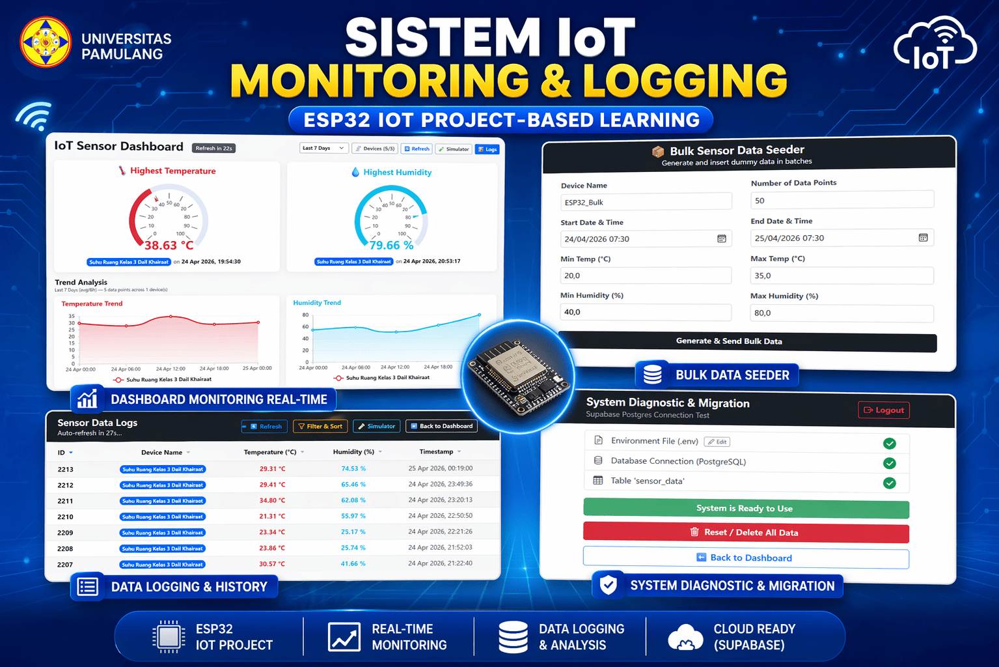

# IoT Sensor Server (PKM UNPAM)

  

A lightweight, secure, and procedural PHP web application designed to act as a robust endpoint for IoT devices (e.g., ESP32/ESP8266, Arduino). It receives real-time environment data—typically Temperature and Humidity—and securely records it into a Supabase PostgreSQL database.

This project was built for the **PKM (Pengabdian Kepada Masyarakat)** program by students of **Universitas Pamulang (UNPAM)**.

This PKM was conducted at **Madrasah Aliyah Da'il Khairaat**, Kalideres, West Jakarta on **April 16, 2026**. You can read the full article on the project lead's post [here](https://www.kompasiana.com/riosatriatama2801/69e4402634777c09f04cd8d3/mahasiswa-s2-teknik-informatika-universitas-pamulang-gelar-pelatihan-iot-berbasis-proyek-di-madrasah-aliyah-da-il-khairaat).

## ✨ Features

- **Advanced Data Dashboard (`index.php`)**: A premium Bootstrap 5-based analytical dashboard featuring data gauges, highest-value badges, line charts for trend analysis, and time-range filtering per device.
- **Data Logs (`logs.php`)**: A paginated, searchable grid interface for viewing historical sensor records effortlessly.
- **Built-in Simulators**:
  - **Single Simulator (`simulator.php`)**: Send single mock data payloads for testing.
  - **Bulk Simulator (`bulk-simulator.php`)**: Programmatically generate and push massive amounts of dummy historical data over a defined timeframe.
- **Secure Supabase Postgres Connect**: Fully migrated to modern `PDO pgsql` featuring built-in emulation mode (`PDO::ATTR_EMULATE_PREPARES=true`) to natively support **pgBouncer pooler connections** (port 6543). Robust Prepared Statements guard against SQL injection.
- **Automated setup & Migrations (`setup.php`)**: A dedicated System Diagnostic & Migration Wizard. It includes native `.env` generation, a visual `.env` configuration editor, and 1-click database migrations.
- **Auth Guarded & Secure**: The setup page is guarded by Session logic (defaults to `admin / password` or configured via `SETUP_USER` and `SETUP_PASS` in `.env`). Implements Apache `.htaccess` boundary checks to hide sensitive endpoints.

## 🚀 Quick Start

### 1. Requirements
* PHP 8.x
* PHP Extensions enabled: `pdo_pgsql`, `pgsql`
* Web Server (Apache natively recommended to support `.htaccess`)
* A [Supabase](https://supabase.com/) Account & Project Database

### 2. Setup Procedure
1. **Clone the repository** to your local web server root (or upload to cPanel).
2. Open `http://your-domain/setup.php` in your browser.
3. **Login** using the default credentials (`admin` / `password`).
4. Click **Create from .env.example** to initialize your configuration file, or click **Edit** to insert your Supabase Database credentials.
5. Once your PostgreSQL connection shows **Green**, click the **"Run Database Migration Now"** button to automatically deploy the `sensor_data` table schema.

## 📡 Hardware Integration (ESP32 / Arduino C++)
Make a standard HTTP POST request natively from your microprocessor pointing to:
`http://your-domain.com/insert-sensor.php`

**Expected Payload (POST/x-www-form-urlencoded):**
- `temperature`: Float (e.g. `24.5`)
- `humidity`: Float (e.g. `60.0`)
- `device_name`: String (e.g. `ESP32_Lab_1`)

*(Optional)* You may also inject historical records by passing an ISO/MySQL formatted DateTime string to the `created_at` parameter.

## 🛠 File Structure & Routing

- `index.php` : The Main Visual Dashboard & Analytics view.
- `logs.php` : Raw paginated data viewing table.
- `simulator.php` : Single request testing harness.
- `bulk-simulator.php` : Bulk historical testing harness.
- `insert-sensor.php` : Secure webhook/API endpoint to ingest device payloads.
- `database.php` : Core PDO connection loader (Protected).
- `setup.php` : Authenticated Migration and Diagnostic Wizard.
- `/.htaccess` : File security and directory restriction policies.

## 📜 License

This project is open-sourced software licensed under the [MIT License](LICENSE).
